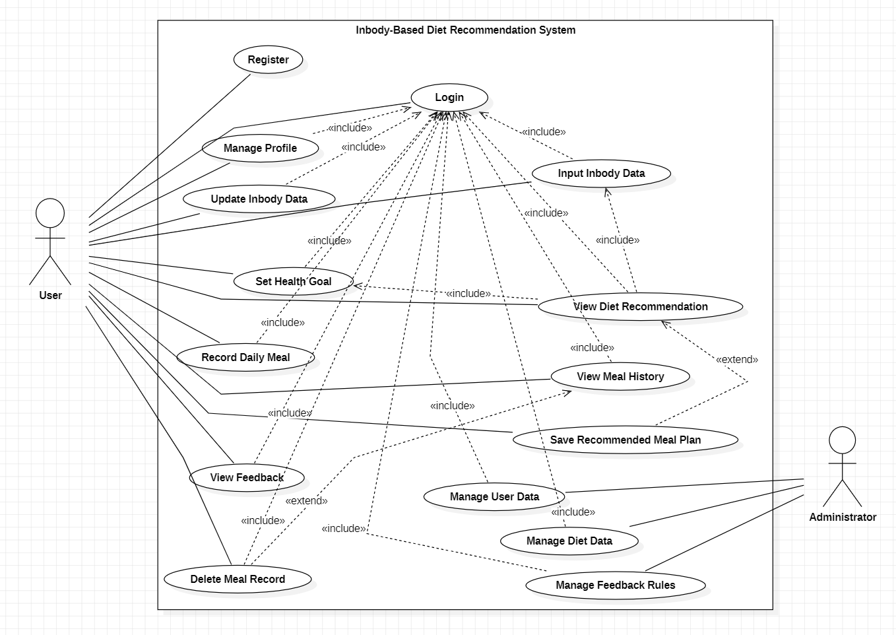
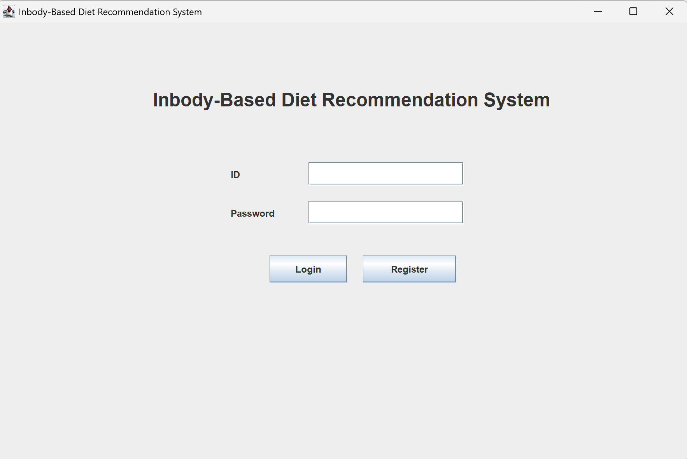
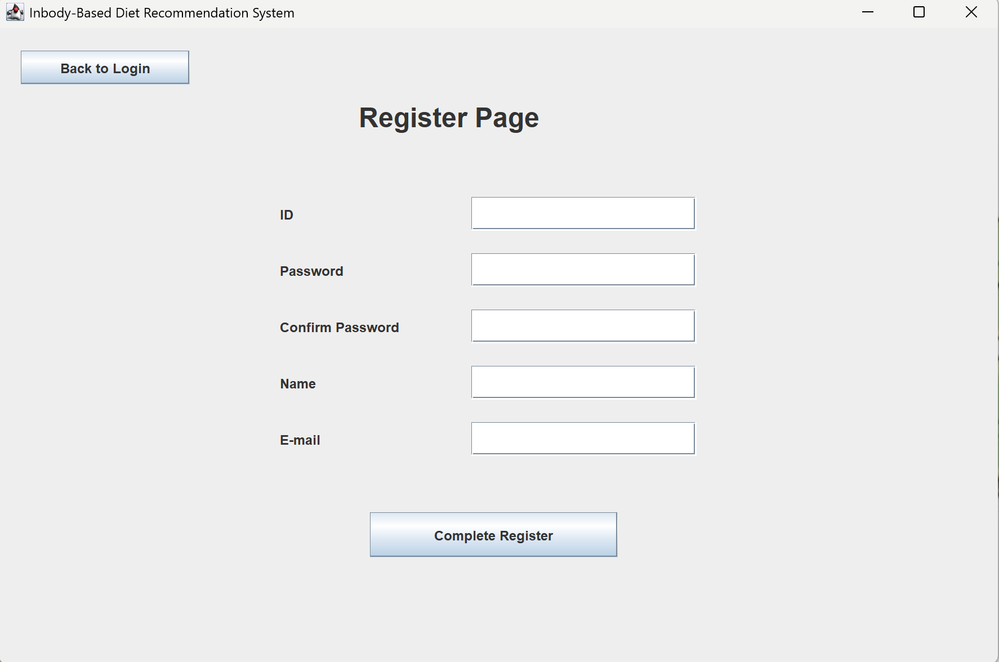
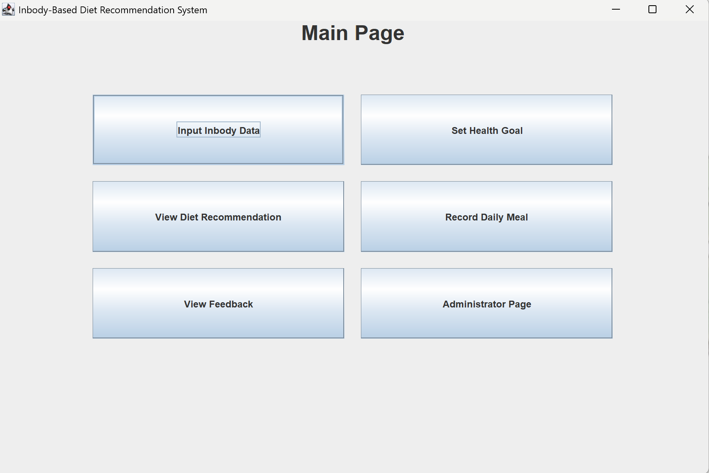
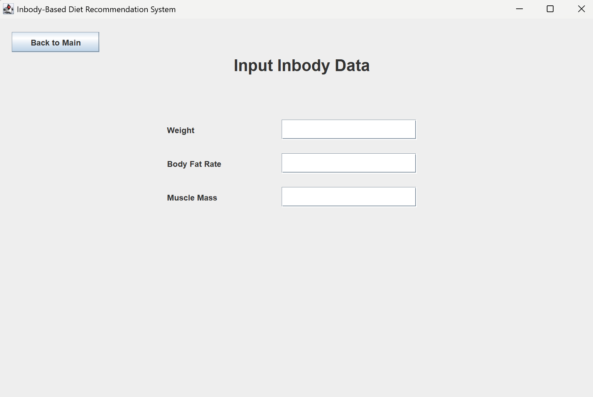
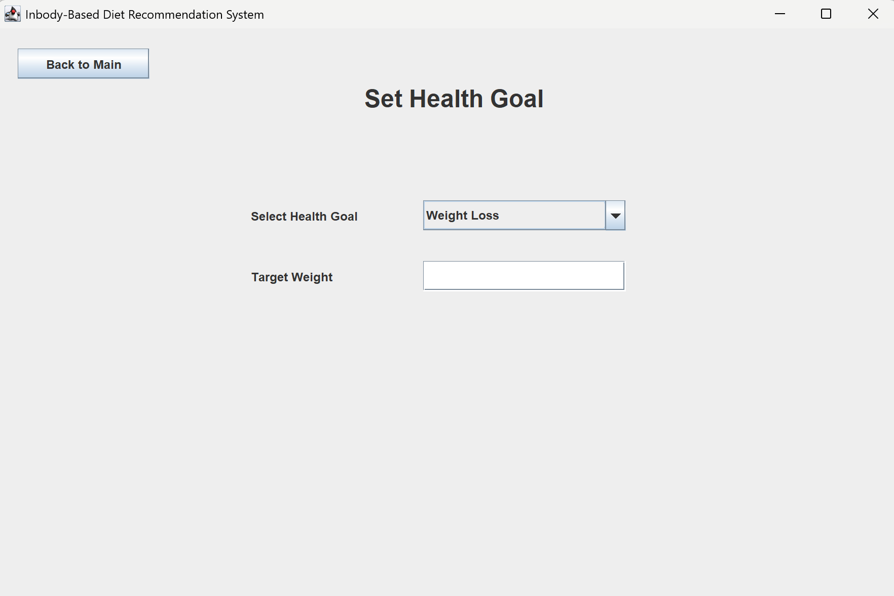
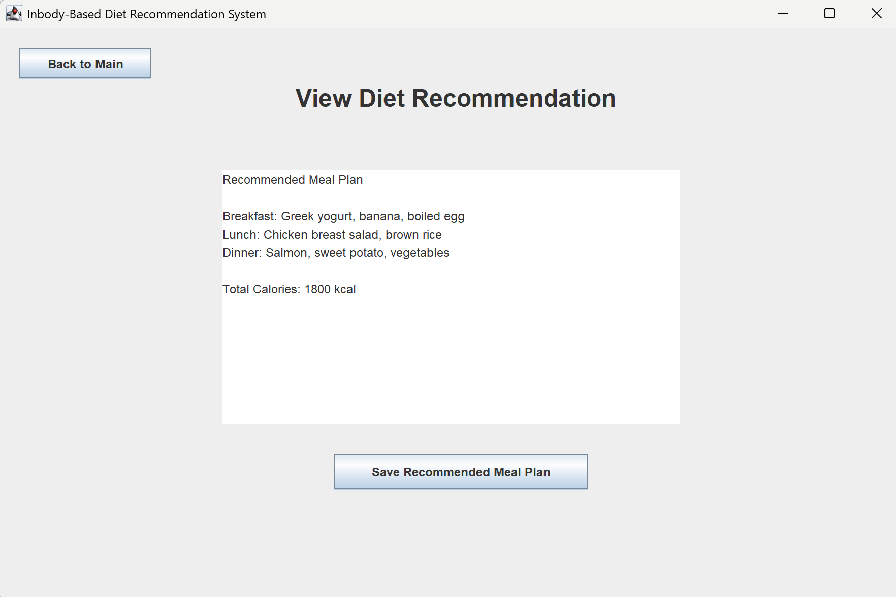
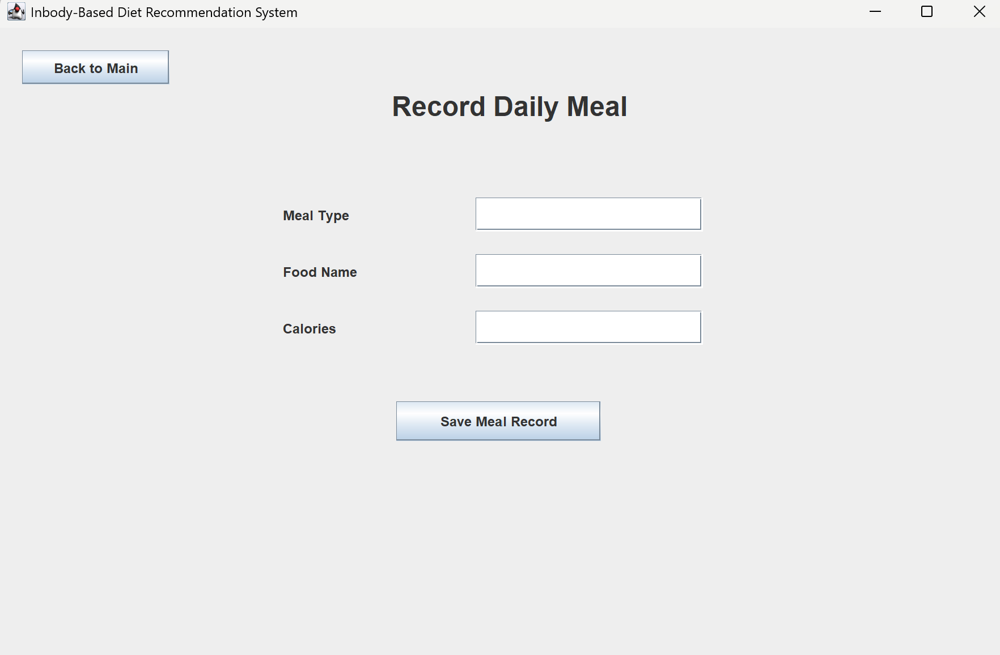
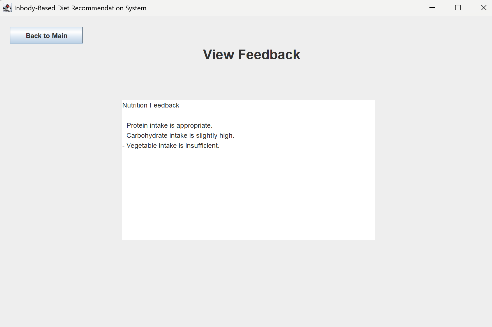
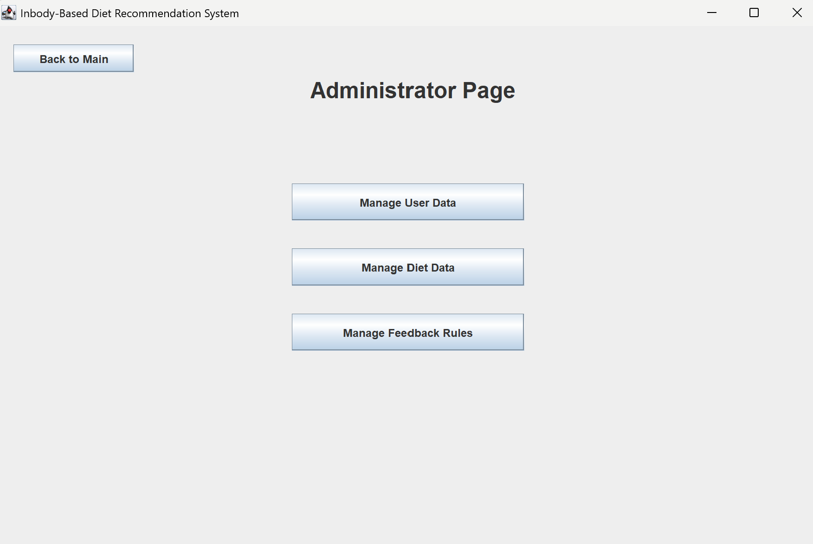

# Analysis

## Project Title
Inbody-Based Diet Recommendation System

## Student Information
- Student No: 22411998
- Name: 장서현
- E-mail: jjsh050413@gmail.com

## 1. Introduction

### 1) Summary

최근 건강 관리와 체중 조절에 대한 관심이 증가하면서 다양한 식단 관리 애플리케이션이 등장하고 있다. 그러나 기존의 시스템은 단순한 칼로리 계산이나 음식 기록 기능에 집중되어 있어 사용자의 신체 상태를 충분히 반영하지 못하는 한계가 있다. 특히 동일한 체중을 가진 사용자라도 체지방률이나 근육량에 따라 필요한 영양소와 식단이 달라지기 때문에 보다 개인화된 관리가 필요하다.

이러한 문제를 해결하기 위해 본 시스템 “Inbody-Based Diet Recommendation System”을 제안한다. 본 시스템은 사용자의 인바디 데이터를 기반으로 맞춤형 식단을 추천하고, 식단 기록을 통해 지속적인 피드백을 제공하여 효율적인 건강 관리를 지원하는 것을 목표로 한다.

---

### 2) Business Goals

본 시스템은 단순히 식단을 기록하거나 칼로리를 계산하는 기능을 넘어서, 사용자에게 개인 맞춤형 식단 추천과 영양 피드백을 제공하는 것을 목표로 한다. 사용자는 자신의 신체 상태와 건강 목표에 맞는 식단을 제공받고, 이를 통해 보다 효율적으로 체중을 관리하거나 건강을 유지할 수 있다.

또한 사용자의 식단 기록 데이터를 기반으로 식습관을 분석하고 개선 방향을 제시함으로써 지속적인 건강 관리가 가능하도록 한다. 주요 타겟 사용자는 체중 감량이나 근육 증가를 원하는 사용자, 그리고 건강한 식습관을 유지하고자 하는 일반 사용자이다.

---

### 3) Technical Goals

기술적인 측면에서 본 시스템은 사용자의 인바디 데이터를 입력받아 이를 기반으로 식단을 추천하는 기능을 구현하는 것을 목표로 한다. 또한 사용자가 입력한 식단 데이터를 분석하여 부족하거나 과도한 영양소에 대한 피드백을 제공하는 기능도 포함된다.

시스템은 사용자 인증 기능을 통해 안전하게 데이터를 관리하며, 데이터베이스를 활용하여 인바디 정보, 식단 기록, 추천 결과 등을 저장하고 처리한다. 또한 사용자 인터페이스를 직관적으로 설계하여 누구나 쉽게 사용할 수 있도록 하고, 빠른 응답 속도를 유지하여 사용자 경험을 향상시키는 것을 목표로 한다.

## 2. Use Case Analysis

### 1) Use Case Diagram

### 2) Use Case Description

#### 2.2.1 Register

| Item | Description |
|---|---|
| Use Case | #1 Register |
| Summary | 사용자가 시스템 이용을 위해 회원가입을 수행한다. |
| Scope | Inbody-Based Diet Recommendation System |
| Level | User level |
| Author | 장서현 |
| Last Update | 05/04/2026 |
| Status | Under Review |
| Primary Actor | User |
| Secondary Actor | Server |
| Preconditions | 사용자가 아직 시스템에 등록되어 있지 않아야 한다. |
| Trigger | 사용자가 회원가입 버튼을 클릭한다. |
| Success Post Condition | 사용자 계정 정보가 시스템에 저장된다. |
| Failed Post Condition | 필수 정보가 누락되었거나 이미 가입된 이메일인 경우 회원가입에 실패한다. |

##### Main Success Scenario

| Step | Action |
|---|---|
| 1 | 사용자가 회원가입 화면에 접속한다. |
| 2 | 이름, 이메일, 비밀번호 등의 정보를 입력한다. |
| 3 | 시스템이 입력된 정보를 확인한다. |
| 4 | 입력 정보가 올바르면 사용자 계정을 생성한다. |
| 5 | 회원가입 완료 메시지를 출력한다. |

##### Extension Scenario

| Step | Branching Action |
|---|---|
| 3a | 필수 입력값이 누락된 경우 오류 메시지를 출력한다. |
| 3b | 이미 등록된 이메일인 경우 중복 이메일 메시지를 출력한다. |

##### Related Information

| Item | Description |
|---|---|
| Performance | 3초 이내에 처리 |
| Frequency | 사용자당 1회 |
| Concurrency | Multiple users |
| Due Date | 05/08/2026 |
| Etc | None |

---

#### 2.2.2 Login

| Item | Description |
|---|---|
| Use Case | #2 Login |
| Summary | 사용자가 아이디와 비밀번호를 입력하여 시스템에 로그인한다. |
| Scope | Inbody-Based Diet Recommendation System |
| Level | User level |
| Author | 장서현 |
| Last Update | 05/04/2026 |
| Status | Under Review |
| Primary Actor | User |
| Secondary Actor | Server |
| Preconditions | 사용자가 회원가입을 완료한 상태여야 한다. |
| Trigger | 사용자가 로그인 버튼을 클릭한다. |
| Success Post Condition | 사용자가 인증되어 시스템 기능을 사용할 수 있다. |
| Failed Post Condition | 아이디 또는 비밀번호가 일치하지 않으면 로그인에 실패한다. |

##### Main Success Scenario

| Step | Action |
|---|---|
| 1 | 사용자가 로그인 화면에 접속한다. |
| 2 | 아이디와 비밀번호를 입력한다. |
| 3 | 시스템이 입력 정보를 확인한다. |
| 4 | 정보가 일치하면 로그인에 성공한다. |
| 5 | 메인 화면으로 이동한다. |

##### Extension Scenario

| Step | Branching Action |
|---|---|
| 3a | 등록되지 않은 아이디인 경우 오류 메시지를 출력한다. |
| 3b | 비밀번호가 틀린 경우 비밀번호 오류 메시지를 출력한다. |

##### Related Information

| Item | Description |
|---|---|
| Performance | 3초 이내에 처리 |
| Frequency | 사용자가 앱을 사용할 때마다 |
| Concurrency | Multiple users |
| Due Date | 05/08/2026 |
| Etc | None |

---

#### 2.2.3 Manage Profile

| Item | Description |
|---|---|
| Use Case | #3 Manage Profile |
| Summary | 사용자가 자신의 기본 정보를 조회하고 수정한다. |
| Scope | Inbody-Based Diet Recommendation System |
| Level | User level |
| Author | 장서현 |
| Last Update | 05/04/2026 |
| Status | Under Review |
| Primary Actor | User |
| Secondary Actor | Server |
| Preconditions | 사용자가 로그인한 상태여야 한다. |
| Trigger | 사용자가 프로필 관리 메뉴를 선택한다. |
| Success Post Condition | 수정된 사용자 정보가 시스템에 저장된다. |
| Failed Post Condition | 입력값 오류 또는 저장 오류로 프로필 수정에 실패한다. |

##### Main Success Scenario

| Step | Action |
|---|---|
| 1 | 사용자가 프로필 관리 화면에 접속한다. |
| 2 | 시스템이 기존 사용자 정보를 보여준다. |
| 3 | 사용자가 나이, 성별, 키, 몸무게 등의 정보를 수정한다. |
| 4 | 사용자가 저장 버튼을 누른다. |
| 5 | 시스템이 수정된 정보를 저장한다. |

##### Extension Scenario

| Step | Branching Action |
|---|---|
| 3a | 잘못된 형식의 정보가 입력되면 오류 메시지를 출력한다. |
| 5a | 서버 저장에 실패하면 저장 실패 메시지를 출력한다. |

##### Related Information

| Item | Description |
|---|---|
| Performance | 3초 이내에 처리 |
| Frequency | 정보 변경 시 |
| Concurrency | Multiple users |
| Due Date | 05/08/2026 |
| Etc | None |

---

#### 2.2.4 Input Inbody Data

| Item | Description |
|---|---|
| Use Case | #4 Input Inbody Data |
| Summary | 사용자가 인바디 측정 결과를 입력한다. |
| Scope | Inbody-Based Diet Recommendation System |
| Level | User level |
| Author | 장서현 |
| Last Update | 05/04/2026 |
| Status | Under Review |
| Primary Actor | User |
| Secondary Actor | Server |
| Preconditions | 사용자가 로그인한 상태여야 한다. |
| Trigger | 사용자가 인바디 정보 입력 메뉴를 선택한다. |
| Success Post Condition | 인바디 데이터가 시스템에 저장된다. |
| Failed Post Condition | 필수 데이터가 누락되거나 잘못된 값이 입력되면 저장에 실패한다. |

##### Main Success Scenario

| Step | Action |
|---|---|
| 1 | 사용자가 인바디 데이터 입력 화면에 접속한다. |
| 2 | 체중, 체지방률, 골격근량 등의 정보를 입력한다. |
| 3 | 시스템이 입력값을 검증한다. |
| 4 | 입력값이 올바르면 데이터를 저장한다. |
| 5 | 저장 완료 메시지를 출력한다. |

##### Extension Scenario

| Step | Branching Action |
|---|---|
| 3a | 숫자 형식이 아닌 값이 입력되면 오류 메시지를 출력한다. |
| 3b | 필수 입력값이 누락되면 입력 요청 메시지를 출력한다. |

##### Related Information

| Item | Description |
|---|---|
| Performance | 3초 이내에 처리 |
| Frequency | 인바디 측정 후 |
| Concurrency | Multiple users |
| Due Date | 05/08/2026 |
| Etc | 식단 추천의 기초 데이터로 사용됨 |

---

#### 2.2.5 Update Inbody Data

| Item | Description |
|---|---|
| Use Case | #5 Update Inbody Data |
| Summary | 사용자가 변경된 신체 정보를 반영하기 위해 인바디 데이터를 수정한다. |
| Scope | Inbody-Based Diet Recommendation System |
| Level | User level |
| Author | 장서현 |
| Last Update | 05/04/2026 |
| Status | Under Review |
| Primary Actor | User |
| Secondary Actor | Server |
| Preconditions | 기존 인바디 데이터가 저장되어 있어야 한다. |
| Trigger | 사용자가 인바디 정보 수정 버튼을 클릭한다. |
| Success Post Condition | 수정된 인바디 데이터가 시스템에 저장된다. |
| Failed Post Condition | 입력값 오류 또는 서버 오류로 수정에 실패한다. |

##### Main Success Scenario

| Step | Action |
|---|---|
| 1 | 사용자가 기존 인바디 데이터를 조회한다. |
| 2 | 변경된 체중, 체지방률, 골격근량 등을 입력한다. |
| 3 | 시스템이 입력값을 검증한다. |
| 4 | 수정된 데이터를 저장한다. |
| 5 | 수정 완료 메시지를 출력한다. |

##### Extension Scenario

| Step | Branching Action |
|---|---|
| 3a | 잘못된 값이 입력되면 오류 메시지를 출력한다. |
| 4a | 저장에 실패하면 수정 실패 메시지를 출력한다. |

##### Related Information

| Item | Description |
|---|---|
| Performance | 3초 이내에 처리 |
| Frequency | 신체 정보 변화 시 |
| Concurrency | Multiple users |
| Due Date | 05/08/2026 |
| Etc | 최신 데이터 기반 추천에 사용됨 |

---

#### 2.2.6 Set Health Goal

| Item | Description |
|---|---|
| Use Case | #6 Set Health Goal |
| Summary | 사용자가 체중 감량, 근육 증가, 건강 유지 등의 목표를 설정한다. |
| Scope | Inbody-Based Diet Recommendation System |
| Level | User level |
| Author | 장서현 |
| Last Update | 05/04/2026 |
| Status | Under Review |
| Primary Actor | User |
| Secondary Actor | Server |
| Preconditions | 사용자가 로그인한 상태여야 한다. |
| Trigger | 사용자가 건강 목표 설정 메뉴를 선택한다. |
| Success Post Condition | 사용자의 건강 목표가 시스템에 저장된다. |
| Failed Post Condition | 목표 선택이 누락되면 저장에 실패한다. |

##### Main Success Scenario

| Step | Action |
|---|---|
| 1 | 사용자가 건강 목표 설정 화면에 접속한다. |
| 2 | 체중 감량, 근육 증가, 건강 유지 중 하나를 선택한다. |
| 3 | 시스템이 선택된 목표를 확인한다. |
| 4 | 목표 정보를 저장한다. |
| 5 | 목표 설정 완료 메시지를 출력한다. |

##### Extension Scenario

| Step | Branching Action |
|---|---|
| 2a | 사용자가 목표를 선택하지 않으면 선택 요청 메시지를 출력한다. |
| 4a | 저장 실패 시 오류 메시지를 출력한다. |

##### Related Information

| Item | Description |
|---|---|
| Performance | 3초 이내에 처리 |
| Frequency | 목표 변경 시 |
| Concurrency | Multiple users |
| Due Date | 05/08/2026 |
| Etc | 식단 추천 기준으로 사용됨 |

---

#### 2.2.7 View Diet Recommendation

| Item | Description |
|---|---|
| Use Case | #7 View Diet Recommendation |
| Summary | 시스템이 사용자 정보 기반으로 추천 식단을 제공하고 사용자가 이를 조회한다. |
| Scope | Inbody-Based Diet Recommendation System |
| Level | User level |
| Author | 장서현 |
| Last Update | 05/04/2026 |
| Status | Under Review |
| Primary Actor | User |
| Secondary Actor | Server |
| Preconditions | 인바디 데이터와 건강 목표가 입력되어 있어야 한다. |
| Trigger | 사용자가 식단 추천 조회 버튼을 클릭한다. |
| Success Post Condition | 사용자에게 맞춤형 추천 식단이 표시된다. |
| Failed Post Condition | 필요한 데이터가 부족하면 추천 결과를 제공하지 못한다. |

##### Main Success Scenario

| Step | Action |
|---|---|
| 1 | 사용자가 식단 추천 메뉴를 선택한다. |
| 2 | 시스템이 사용자의 인바디 데이터와 건강 목표를 불러온다. |
| 3 | 시스템이 사용자 상태를 분석한다. |
| 4 | 시스템이 적절한 추천 식단을 생성한다. |
| 5 | 추천 식단을 화면에 출력한다. |

##### Extension Scenario

| Step | Branching Action |
|---|---|
| 2a | 인바디 데이터가 없으면 인바디 입력 화면으로 이동하도록 안내한다. |
| 2b | 건강 목표가 없으면 목표 설정을 요청한다. |
| 4a | 추천 가능한 식단 데이터가 부족하면 기본 식단을 제공한다. |

##### Related Information

| Item | Description |
|---|---|
| Performance | 3초 이내에 처리 |
| Frequency | 사용자가 식단 추천을 요청할 때 |
| Concurrency | Multiple users |
| Due Date | 05/08/2026 |
| Etc | 인바디 데이터와 목표를 포함 관계로 사용함 |

---

#### 2.2.8 Record Daily Meal

| Item | Description |
|---|---|
| Use Case | #8 Record Daily Meal |
| Summary | 사용자가 하루 동안 섭취한 식단을 기록한다. |
| Scope | Inbody-Based Diet Recommendation System |
| Level | User level |
| Author | 장서현 |
| Last Update | 05/04/2026 |
| Status | Under Review |
| Primary Actor | User |
| Secondary Actor | Server |
| Preconditions | 사용자가 로그인한 상태여야 한다. |
| Trigger | 사용자가 식단 기록 메뉴를 선택한다. |
| Success Post Condition | 사용자의 식단 기록이 시스템에 저장된다. |
| Failed Post Condition | 음식 정보가 누락되거나 저장 오류가 발생하면 기록에 실패한다. |

##### Main Success Scenario

| Step | Action |
|---|---|
| 1 | 사용자가 식단 기록 화면에 접속한다. |
| 2 | 아침, 점심, 저녁 또는 간식 정보를 입력한다. |
| 3 | 시스템이 입력된 음식 정보를 확인한다. |
| 4 | 식단 기록을 저장한다. |
| 5 | 저장 완료 메시지를 출력한다. |

##### Extension Scenario

| Step | Branching Action |
|---|---|
| 2a | 음식명이 입력되지 않으면 입력 요청 메시지를 출력한다. |
| 4a | 서버 저장에 실패하면 저장 실패 메시지를 출력한다. |

##### Related Information

| Item | Description |
|---|---|
| Performance | 3초 이내에 처리 |
| Frequency | 하루 여러 번 |
| Concurrency | Multiple users |
| Due Date | 05/08/2026 |
| Etc | 피드백 생성을 위한 데이터로 사용됨 |

---

#### 2.2.9 View Meal History

| Item | Description |
|---|---|
| Use Case | #9 View Meal History |
| Summary | 사용자가 이전에 기록한 식단 내역을 조회한다. |
| Scope | Inbody-Based Diet Recommendation System |
| Level | User level |
| Author | 장서현 |
| Last Update | 05/04/2026 |
| Status | Under Review |
| Primary Actor | User |
| Secondary Actor | Server |
| Preconditions | 하나 이상의 식단 기록이 존재해야 한다. |
| Trigger | 사용자가 식단 기록 조회 메뉴를 선택한다. |
| Success Post Condition | 저장된 식단 기록이 날짜별로 표시된다. |
| Failed Post Condition | 기록이 없거나 서버 오류가 발생하면 조회에 실패한다. |

##### Main Success Scenario

| Step | Action |
|---|---|
| 1 | 사용자가 식단 기록 조회 화면에 접속한다. |
| 2 | 시스템이 사용자의 식단 기록 데이터를 불러온다. |
| 3 | 시스템이 날짜별 식단 기록을 정리한다. |
| 4 | 식단 기록을 화면에 출력한다. |

##### Extension Scenario

| Step | Branching Action |
|---|---|
| 2a | 저장된 식단 기록이 없는 경우 기록 없음 메시지를 출력한다. |
| 2b | 서버 연결 실패 시 오류 메시지를 출력한다. |

##### Related Information

| Item | Description |
|---|---|
| Performance | 3초 이내에 처리 |
| Frequency | 사용자가 기록을 확인할 때 |
| Concurrency | Multiple users |
| Due Date | 05/08/2026 |
| Etc | 삭제 기능과 연결될 수 있음 |

---

#### 2.2.10 View Feedback

| Item | Description |
|---|---|
| Use Case | #10 View Feedback |
| Summary | 사용자가 식단 기록과 목표를 기반으로 제공되는 영양 피드백을 확인한다. |
| Scope | Inbody-Based Diet Recommendation System |
| Level | User level |
| Author | 장서현 |
| Last Update | 05/04/2026 |
| Status | Under Review |
| Primary Actor | User |
| Secondary Actor | Server |
| Preconditions | 식단 기록과 건강 목표가 존재해야 한다. |
| Trigger | 사용자가 피드백 조회 버튼을 클릭한다. |
| Success Post Condition | 영양 분석 결과와 개선 방향이 화면에 출력된다. |
| Failed Post Condition | 분석할 식단 기록이 없으면 피드백을 제공하지 못한다. |

##### Main Success Scenario

| Step | Action |
|---|---|
| 1 | 사용자가 피드백 조회 화면에 접속한다. |
| 2 | 시스템이 사용자의 식단 기록과 건강 목표를 불러온다. |
| 3 | 시스템이 영양 섭취 상태를 분석한다. |
| 4 | 부족하거나 과도한 영양소를 판단한다. |
| 5 | 영양 피드백을 화면에 출력한다. |

##### Extension Scenario

| Step | Branching Action |
|---|---|
| 2a | 식단 기록이 없으면 식단 기록을 먼저 입력하도록 안내한다. |
| 3a | 분석 데이터가 부족하면 기본 피드백을 제공한다. |

##### Related Information

| Item | Description |
|---|---|
| Performance | 3초 이내에 처리 |
| Frequency | 식단 기록 후 |
| Concurrency | Multiple users |
| Due Date | 05/08/2026 |
| Etc | 식습관 개선을 위한 핵심 기능 |

---

#### 2.2.11 Save Recommended Meal Plan

| Item | Description |
|---|---|
| Use Case | #11 Save Recommended Meal Plan |
| Summary | 사용자가 추천받은 식단을 저장한다. |
| Scope | Inbody-Based Diet Recommendation System |
| Level | User level |
| Author | 장서현 |
| Last Update | 05/04/2026 |
| Status | Under Review |
| Primary Actor | User |
| Secondary Actor | Server |
| Preconditions | 추천 식단이 화면에 표시되어 있어야 한다. |
| Trigger | 사용자가 추천 식단 저장 버튼을 클릭한다. |
| Success Post Condition | 추천 식단이 사용자 계정에 저장된다. |
| Failed Post Condition | 서버 오류 또는 저장 공간 문제로 저장에 실패한다. |

##### Main Success Scenario

| Step | Action |
|---|---|
| 1 | 사용자가 추천 식단을 조회한다. |
| 2 | 저장하고 싶은 식단을 선택한다. |
| 3 | 사용자가 저장 버튼을 클릭한다. |
| 4 | 시스템이 추천 식단을 저장한다. |
| 5 | 저장 완료 메시지를 출력한다. |

##### Extension Scenario

| Step | Branching Action |
|---|---|
| 3a | 사용자가 저장을 취소하면 식단 추천 화면으로 돌아간다. |
| 4a | 저장 실패 시 오류 메시지를 출력한다. |

##### Related Information

| Item | Description |
|---|---|
| Performance | 3초 이내에 처리 |
| Frequency | 추천 식단 저장 시 |
| Concurrency | Multiple users |
| Due Date | 05/08/2026 |
| Etc | View Diet Recommendation의 확장 기능 |

---

#### 2.2.12 Delete Meal Record

| Item | Description |
|---|---|
| Use Case | #12 Delete Meal Record |
| Summary | 사용자가 잘못 입력한 식단 기록을 삭제한다. |
| Scope | Inbody-Based Diet Recommendation System |
| Level | User level |
| Author | 장서현 |
| Last Update | 05/04/2026 |
| Status | Under Review |
| Primary Actor | User |
| Secondary Actor | Server |
| Preconditions | 삭제할 식단 기록이 존재해야 한다. |
| Trigger | 사용자가 식단 기록 삭제 버튼을 클릭한다. |
| Success Post Condition | 선택한 식단 기록이 시스템에서 삭제된다. |
| Failed Post Condition | 삭제 권한이 없거나 서버 오류가 발생하면 삭제에 실패한다. |

##### Main Success Scenario

| Step | Action |
|---|---|
| 1 | 사용자가 식단 기록 조회 화면에 접속한다. |
| 2 | 삭제할 식단 기록을 선택한다. |
| 3 | 사용자가 삭제 버튼을 클릭한다. |
| 4 | 시스템이 삭제 여부를 확인한다. |
| 5 | 사용자가 확인하면 해당 기록을 삭제한다. |

##### Extension Scenario

| Step | Branching Action |
|---|---|
| 4a | 사용자가 삭제를 취소하면 기록 조회 화면으로 돌아간다. |
| 5a | 서버 오류가 발생하면 삭제 실패 메시지를 출력한다. |

##### Related Information

| Item | Description |
|---|---|
| Performance | 3초 이내에 처리 |
| Frequency | 잘못된 기록이 있을 때 |
| Concurrency | Multiple users |
| Due Date | 05/08/2026 |
| Etc | View Meal History의 확장 기능 |

---

#### 2.2.13 Manage User Data

| Item | Description |
|---|---|
| Use Case | #13 Manage User Data |
| Summary | 관리자가 사용자 계정 및 정보를 관리한다. |
| Scope | Inbody-Based Diet Recommendation System |
| Level | Admin level |
| Author | 장서현 |
| Last Update | 05/04/2026 |
| Status | Under Review |
| Primary Actor | Administrator |
| Secondary Actor | Server |
| Preconditions | 관리자가 로그인한 상태여야 한다. |
| Trigger | 관리자가 사용자 정보 관리 메뉴를 선택한다. |
| Success Post Condition | 사용자 정보가 조회, 수정 또는 삭제된다. |
| Failed Post Condition | 관리자 권한이 없거나 서버 오류가 발생하면 관리 기능을 사용할 수 없다. |

##### Main Success Scenario

| Step | Action |
|---|---|
| 1 | 관리자가 사용자 정보 관리 화면에 접속한다. |
| 2 | 시스템이 사용자 목록을 불러온다. |
| 3 | 관리자가 특정 사용자를 선택한다. |
| 4 | 관리자가 사용자 정보를 조회, 수정 또는 삭제한다. |
| 5 | 시스템이 변경된 정보를 저장한다. |

##### Extension Scenario

| Step | Branching Action |
|---|---|
| 2a | 사용자 목록을 불러오지 못하면 오류 메시지를 출력한다. |
| 4a | 관리자 권한이 없으면 접근 제한 메시지를 출력한다. |

##### Related Information

| Item | Description |
|---|---|
| Performance | 3초 이내에 처리 |
| Frequency | 관리자 필요 시 |
| Concurrency | Administrator only |
| Due Date | 05/08/2026 |
| Etc | 관리자 전용 기능 |

---

#### 2.2.14 Manage Diet Data

| Item | Description |
|---|---|
| Use Case | #14 Manage Diet Data |
| Summary | 관리자가 식단 및 영양 데이터를 추가, 수정, 삭제한다. |
| Scope | Inbody-Based Diet Recommendation System |
| Level | Admin level |
| Author | 장서현 |
| Last Update | 05/04/2026 |
| Status | Under Review |
| Primary Actor | Administrator |
| Secondary Actor | Server |
| Preconditions | 관리자가 로그인한 상태여야 한다. |
| Trigger | 관리자가 식단 데이터 관리 메뉴를 선택한다. |
| Success Post Condition | 식단 및 영양 데이터가 시스템에 반영된다. |
| Failed Post Condition | 입력 오류 또는 서버 오류로 데이터 수정에 실패한다. |

##### Main Success Scenario

| Step | Action |
|---|---|
| 1 | 관리자가 식단 데이터 관리 화면에 접속한다. |
| 2 | 시스템이 기존 식단 데이터를 보여준다. |
| 3 | 관리자가 식단 또는 영양 정보를 추가, 수정, 삭제한다. |
| 4 | 시스템이 변경 내용을 검증한다. |
| 5 | 변경된 데이터를 저장한다. |

##### Extension Scenario

| Step | Branching Action |
|---|---|
| 3a | 필수 정보가 누락되면 오류 메시지를 출력한다. |
| 5a | 저장 실패 시 실패 메시지를 출력한다. |

##### Related Information

| Item | Description |
|---|---|
| Performance | 3초 이내에 처리 |
| Frequency | 식단 데이터 변경 시 |
| Concurrency | Administrator only |
| Due Date | 05/08/2026 |
| Etc | 추천 정확도에 영향을 주는 데이터 |

---

#### 2.2.15 Manage Feedback Rules

| Item | Description |
|---|---|
| Use Case | #15 Manage Feedback Rules |
| Summary | 관리자가 피드백 제공 기준 및 규칙을 관리한다. |
| Scope | Inbody-Based Diet Recommendation System |
| Level | Admin level |
| Author | 장서현 |
| Last Update | 05/04/2026 |
| Status | Under Review |
| Primary Actor | Administrator |
| Secondary Actor | Server |
| Preconditions | 관리자가 로그인한 상태여야 한다. |
| Trigger | 관리자가 피드백 규칙 관리 메뉴를 선택한다. |
| Success Post Condition | 피드백 규칙이 시스템에 저장되고 이후 분석에 적용된다. |
| Failed Post Condition | 규칙 입력 오류 또는 저장 오류가 발생하면 관리에 실패한다. |

##### Main Success Scenario

| Step | Action |
|---|---|
| 1 | 관리자가 피드백 규칙 관리 화면에 접속한다. |
| 2 | 시스템이 기존 피드백 규칙을 보여준다. |
| 3 | 관리자가 영양소 기준 또는 피드백 조건을 수정한다. |
| 4 | 시스템이 규칙의 형식을 검증한다. |
| 5 | 변경된 피드백 규칙을 저장한다. |

##### Extension Scenario

| Step | Branching Action |
|---|---|
| 3a | 잘못된 기준값이 입력되면 오류 메시지를 출력한다. |
| 5a | 저장에 실패하면 실패 메시지를 출력한다. |

##### Related Information

| Item | Description |
|---|---|
| Performance | 3초 이내에 처리 |
| Frequency | 피드백 정책 변경 시 |
| Concurrency | Administrator only |
| Due Date | 05/08/2026 |
| Etc | 영양 피드백 생성 기준으로 사용됨 |

# 3. Domain Analysis

## 1) Domain Class List

| Class Name | Description |
|---|---|
| User | 시스템을 사용하는 사용자 정보를 저장하는 클래스이다. |
| Administrator | 사용자 및 시스템 데이터를 관리하는 관리자 클래스이다. |
| Profile | 사용자의 기본 정보(나이, 성별, 키, 몸무게 등)를 저장하는 클래스이다. |
| InbodyData | 사용자의 인바디 측정 결과를 저장하는 클래스이다. |
| HealthGoal | 사용자의 건강 목표 정보를 저장하는 클래스이다. |
| DietRecommendation | 사용자 상태에 맞는 추천 식단 정보를 저장하는 클래스이다. |
| MealRecord | 사용자가 기록한 일일 식단 정보를 저장하는 클래스이다. |
| MealHistory | 사용자의 과거 식단 기록 목록을 관리하는 클래스이다. |
| Feedback | 사용자의 식단 상태에 대한 영양 피드백 정보를 저장하는 클래스이다. |
| MealPlan | 추천 식단 저장 정보를 관리하는 클래스이다. |
| DietData | 음식 및 영양 성분 데이터를 저장하는 클래스이다. |
| FeedbackRule | 영양 피드백 생성 기준 및 규칙을 저장하는 클래스이다. |
| Authentication | 회원가입 및 로그인 인증 기능을 처리하는 클래스이다. |
| Database | 사용자 정보, 식단 기록, 추천 결과 등을 저장하고 관리하는 데이터베이스 클래스이다. |

---

## 2) Description of Each Class

### (1) User

| Item | Description |
|---|---|
| Class Name | User |
| Role | 시스템의 일반 사용자 정보를 관리한다. |
| Main Attributes | userId, password, name, email |
| Main Functions | login(), logout(), register() |

---

### (2) Administrator

| Item | Description |
|---|---|
| Class Name | Administrator |
| Role | 사용자 데이터와 시스템 정보를 관리한다. |
| Main Attributes | adminId, password |
| Main Functions | manageUserData(), manageDietData(), manageFeedbackRules() |

---

### (3) Profile

| Item | Description |
|---|---|
| Class Name | Profile |
| Role | 사용자의 기본 신체 정보를 저장한다. |
| Main Attributes | age, gender, height, weight |
| Main Functions | updateProfile(), viewProfile() |

---

### (4) InbodyData

| Item | Description |
|---|---|
| Class Name | InbodyData |
| Role | 인바디 측정 결과를 저장한다. |
| Main Attributes | bodyFat, muscleMass, bmi |
| Main Functions | inputData(), updateData() |

---

### (5) HealthGoal

| Item | Description |
|---|---|
| Class Name | HealthGoal |
| Role | 사용자의 건강 목표를 저장한다. |
| Main Attributes | goalType, targetWeight |
| Main Functions | setGoal(), updateGoal() |

---

### (6) DietRecommendation

| Item | Description |
|---|---|
| Class Name | DietRecommendation |
| Role | 사용자 맞춤형 추천 식단을 생성한다. |
| Main Attributes | recommendationId, menuList |
| Main Functions | generateRecommendation(), viewRecommendation() |

---

### (7) MealRecord

| Item | Description |
|---|---|
| Class Name | MealRecord |
| Role | 사용자의 일일 식단 기록을 저장한다. |
| Main Attributes | mealType, foodName, calorie |
| Main Functions | recordMeal(), deleteMeal() |

---

### (8) MealHistory

| Item | Description |
|---|---|
| Class Name | MealHistory |
| Role | 사용자의 과거 식단 기록을 조회한다. |
| Main Attributes | historyList |
| Main Functions | viewHistory() |

---

### (9) Feedback

| Item | Description |
|---|---|
| Class Name | Feedback |
| Role | 사용자 식단 분석 결과를 제공한다. |
| Main Attributes | feedbackMessage, nutritionStatus |
| Main Functions | generateFeedback(), viewFeedback() |

---

### (10) MealPlan

| Item | Description |
|---|---|
| Class Name | MealPlan |
| Role | 저장된 추천 식단을 관리한다. |
| Main Attributes | savedPlanList |
| Main Functions | saveMealPlan(), loadMealPlan() |

---

### (11) DietData

| Item | Description |
|---|---|
| Class Name | DietData |
| Role | 음식 및 영양 정보를 저장한다. |
| Main Attributes | foodName, protein, carbohydrate, fat |
| Main Functions | addDietData(), updateDietData(), deleteDietData() |

---

### (12) FeedbackRule

| Item | Description |
|---|---|
| Class Name | FeedbackRule |
| Role | 영양 피드백 생성 기준을 관리한다. |
| Main Attributes | ruleId, condition |
| Main Functions | addRule(), updateRule() |

---

### (13) Authentication

| Item | Description |
|---|---|
| Class Name | Authentication |
| Role | 회원가입 및 로그인 인증을 처리한다. |
| Main Attributes | sessionId |
| Main Functions | authenticateUser(), validatePassword() |

---

### (14) Database

| Item | Description |
|---|---|
| Class Name | Database |
| Role | 시스템 데이터를 저장하고 관리한다. |
| Main Attributes | userTable, mealTable, recommendationTable |
| Main Functions | saveData(), loadData(), deleteData() |

# 4. User Interface prototype

본 시스템의 User Interface Prototype은 Java Swing을 이용하여 구현하였다.  
사용자는 프로그램을 실행한 후 로그인 화면을 통해 시스템에 접속할 수 있으며, 로그인 이후 메인 화면에서 다양한 기능을 사용할 수 있다.  
각 화면은 버튼을 통해 이동할 수 있도록 구성하였고, 사용자가 쉽게 사용할 수 있도록 직관적인 인터페이스 형태로 설계하였다.

---

## 4.1 Login Page

사용자가 프로그램을 실행하면 아래와 같은 Login Page가 출력된다.  
사용자는 ID와 Password를 입력한 후 Login 버튼을 눌러 시스템 내부로 접속할 수 있다.  
회원가입이 필요한 경우 Register 버튼을 선택하여 회원가입 화면으로 이동할 수 있다.

Login Page에는 ID 입력칸, Password 입력칸, Login 버튼, Register 버튼이 존재한다.  
Login 버튼을 누르면 Main Page로 이동하며, 사용자는 시스템의 주요 기능을 사용할 수 있다.

---

## 4.2 Register Page

아래의 화면은 회원가입을 위한 Register Page이다.  
사용자는 회원가입에 필요한 정보를 입력한 후 Register 버튼을 눌러 회원가입을 진행할 수 있다.

회원가입이 완료되면 사용자는 Login Page로 이동하여 시스템에 로그인할 수 있다.  
회원가입 기능을 통해 새로운 사용자를 시스템에 등록할 수 있다.

---

## 4.3 Main Page

로그인에 성공하면 아래와 같은 Main Page가 출력된다.  
Main Page는 사용자가 시스템의 주요 기능을 선택할 수 있는 화면이다.

Main Page에서는 Input Inbody Data, Set Health Goal, View Diet Recommendation, Record Daily Meal, View Feedback, Administrator Page 기능을 선택할 수 있다.  
사용자는 원하는 버튼을 클릭하여 해당 기능 화면으로 이동할 수 있다.

---

## 4.4 Input Inbody Data Page

아래의 화면은 사용자의 인바디 정보를 입력하는 화면이다.  
사용자는 자신의 Weight, Body Fat Rate, Muscle Mass 값을 입력할 수 있다.

입력된 인바디 정보는 이후 식단 추천과 피드백 제공에 활용된다.  
Back to Main 버튼을 누르면 다시 Main Page로 이동할 수 있다.

---

## 4.5 Set Health Goal Page

아래의 화면은 사용자의 건강 목표를 설정하는 화면이다.  
사용자는 Weight Loss, Muscle Gain, Maintain Health 중 하나를 선택할 수 있으며, 목표 체중(Target Weight)을 입력할 수 있다.

건강 목표 정보는 사용자 맞춤형 식단 추천 기능에 활용된다.  
사용자의 목표에 따라 추천 식단과 피드백 내용이 달라질 수 있다.

---

## 4.6 View Diet Recommendation Page

아래의 화면은 사용자에게 추천 식단을 제공하는 화면이다.  
시스템은 사용자의 인바디 정보와 건강 목표를 바탕으로 추천 식단을 출력한다.

추천 식단에는 아침, 점심, 저녁 식단과 총 칼로리 정보가 포함된다.  
또한 단백질, 탄수화물, 지방에 대한 영양 정보도 함께 제공된다.  
사용자는 Save Recommended Meal Plan 버튼을 눌러 추천 식단을 저장할 수 있다.

---

## 4.7 Record Daily Meal Page

아래의 화면은 사용자가 하루 동안 섭취한 식단을 기록하는 화면이다.  
사용자는 Meal Type, Food Name, Calories 정보를 입력할 수 있다.

입력된 식사 기록은 사용자의 영양 상태 분석과 피드백 제공에 활용된다.  
Save Meal Record 버튼을 누르면 식사 기록이 저장된다.

---

## 4.8 View Feedback Page

아래의 화면은 사용자의 식단 기록을 분석한 결과를 보여주는 화면이다.

시스템은 단백질, 탄수화물, 채소 섭취 상태를 분석하여 사용자에게 영양 피드백을 제공한다.  
또한 부족하거나 과다한 영양 섭취에 대한 개선 방향도 함께 제공한다.

---

## 4.9 Administrator Page

아래의 화면은 관리자가 시스템 데이터를 관리하는 화면이다.

관리자는 Manage User Data, Manage Diet Data, Manage Feedback Rules 기능을 통해 사용자 정보, 식단 데이터, 피드백 규칙 등을 관리할 수 있다.  
Administrator Page는 시스템의 전반적인 데이터 관리 기능을 담당한다.

# 5. Glossary

용어사전에 대한 내용은 다음과 같다.

| Term | Description |
| --- | --- |
| Inbody-Based Diet Recommendation System | 사용자의 인바디 정보와 건강 목표를 기반으로 맞춤형 식단을 추천하는 시스템 |
| User | 시스템을 사용하는 일반 사용자 |
| Administrator | 사용자 데이터와 식단 데이터를 관리하는 관리자 |
| Inbody Data | 사용자의 체중, 체지방률, 근육량 등의 신체 정보 |
| Weight | 사용자의 체중 정보 |
| Body Fat Rate | 사용자의 체지방 비율 정보 |
| Muscle Mass | 사용자의 골격근량 정보 |
| Health Goal | 사용자가 설정하는 건강 목표 |
| Weight Loss | 체중 감량을 목표로 하는 건강 목표 |
| Muscle Gain | 근육 증가를 목표로 하는 건강 목표 |
| Maintain Health | 현재 건강 상태 유지를 목표로 하는 건강 목표 |
| Meal Record | 사용자가 하루 동안 섭취한 식단 기록 |
| Meal Type | 아침, 점심, 저녁과 같은 식사 종류 |
| Recommended Meal Plan | 시스템이 사용자에게 추천하는 식단 정보 |
| Nutrition Feedback | 사용자의 식단 상태를 분석하여 제공하는 피드백 |
| Calories | 음식의 칼로리 정보 |
| Protein | 단백질 영양 정보 |
| Carbohydrate | 탄수화물 영양 정보 |
| Fat | 지방 영양 정보 |
| GUI | Graphical User Interface의 약자로 그래픽 기반 사용자 인터페이스 |
| Database | 사용자 정보와 식단 데이터를 저장하기 위한 데이터 저장소 |

## 6. References

-  JAVA Language GUI
  (https://www.jetbrains.com/idea/)

- StarUML Official Website
  (https://staruml.io/)
