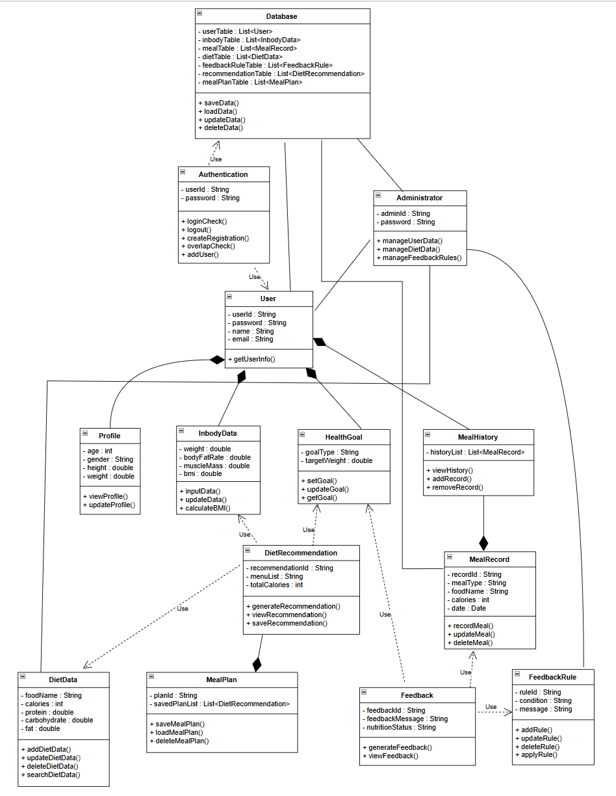

# Design

## Project Title

Inbody-Based Diet Recommendation System

## Student Information

- Student No: 22411998
- Name: 장서현
- E-mail: jjsh050413@gmail.com

# 1. Introduction

## 1.1 Summary

최근 건강 관리와 체중 조절에 대한 관심이 증가하면서 다양한 건강 관리 애플리케이션이 활용되고 있다. 그러나 대부분의 기존 식단 관리 시스템은 단순한 칼로리 계산이나 음식 기록 기능에 집중되어 있어 사용자의 신체 상태를 충분히 반영하지 못하는 한계가 있다. 특히 동일한 체중을 가진 사용자라도 체지방률, 골격근량, 건강 목표 등에 따라 필요한 영양소와 식단 구성이 달라지기 때문에 보다 개인화된 식단 관리가 필요하다.

본 프로젝트는 이러한 문제를 해결하기 위해 사용자의 인바디 정보를 기반으로 개인 맞춤형 식단을 추천하는 **Inbody-Based Diet Recommendation System**을 설계한다. 사용자는 자신의 체중, 체지방률, 골격근량 등의 인바디 데이터를 입력하고 체중 감량, 근육 증가, 건강 유지와 같은 목표를 설정할 수 있다. 시스템은 입력된 정보를 분석하여 사용자에게 적합한 식단을 추천하며, 사용자가 기록한 식단 데이터를 기반으로 영양 상태를 분석하고 피드백을 제공한다.

또한 사용자는 식단 기록 조회, 추천 식단 저장, 인바디 정보 수정 등의 기능을 통해 자신의 건강 상태를 지속적으로 관리할 수 있으며, 관리자는 사용자 정보, 식단 데이터 및 피드백 규칙을 관리하여 시스템을 운영할 수 있다.

본 Design 문서에서는 시스템을 구성하는 클래스와 클래스 간의 관계를 정의하는 Class Diagram, 주요 기능의 동작 과정을 표현하는 Sequence Diagram, 그리고 시스템의 상태 변화를 나타내는 State Machine Diagram을 설계하여 실제 구현을 위한 구체적인 구조를 제시한다.

## 1.2 Important Points of Design

- 사용자의 인바디 정보와 건강 목표를 기반으로 개인 맞춤형 식단을 추천할 수 있도록 설계한다.
- 사용자 정보 관리, 인바디 데이터 관리, 식단 추천, 식단 기록, 영양 피드백 기능을 독립적인 클래스로 분리하여 설계한다.
- Java Swing 기반의 직관적인 사용자 인터페이스를 제공하여 사용 편의성을 향상시킨다.
- 객체지향 설계를 적용하여 클래스 간 역할과 책임을 명확하게 분리하고 유지보수성을 높인다.
- 사용자 정보와 식단 데이터를 효율적으로 저장하고 관리할 수 있는 데이터 구조를 설계한다.
- 사용자 인증 기능을 통해 개인정보와 건강 데이터를 안전하게 관리할 수 있도록 설계한다.
- 향후 새로운 추천 알고리즘이나 추가 기능이 쉽게 적용될 수 있도록 확장성을 고려하여 설계한다.

# 2. Class Diagram

## 2.1 Class Diagram

본 시스템의 Class Diagram은 사용자 정보 관리, 인바디 데이터 관리, 건강 목표 설정, 식단 추천, 식단 기록 관리, 영양 피드백 제공, 관리자 기능 및 데이터 저장 기능을 중심으로 설계하였다.

사용자는 Profile, InbodyData, HealthGoal, MealHistory 정보를 포함하며, MealHistory는 여러 개의 MealRecord를 관리한다. DietRecommendation 클래스는 사용자의 인바디 정보와 건강 목표, 음식 데이터를 분석하여 맞춤형 식단을 추천한다. 또한 Feedback 클래스는 사용자의 식단 기록과 건강 목표를 분석하고 피드백 규칙을 적용하여 영양 피드백을 생성한다.

관리자는 사용자 정보, 식단 데이터 및 피드백 규칙을 관리하며, Database 클래스는 시스템의 모든 데이터를 저장하고 관리하는 역할을 수행한다.

---

## 2.2 Description of Each Class

### (1) User

| 항목 | 내용 |
|------|------|
| 클래스명 | User |
| 역할 | 시스템 사용자 정보를 관리한다. |
| 속성 | userId : String, password : String, name : String, email : String |
| 메서드 | getUserInfo() |
| 기타 | Profile, InbodyData, HealthGoal, MealHistory를 포함한다. |

---

### (2) Administrator

| 항목 | 내용 |
|------|------|
| 클래스명 | Administrator |
| 역할 | 사용자 정보, 식단 데이터, 피드백 규칙을 관리한다. |
| 속성 | adminId : String, password : String |
| 메서드 | manageUserData(), manageDietData(), manageFeedbackRules() |
| 기타 | User, DietData, FeedbackRule과 연관된다. |

---

### (3) Profile

| 항목 | 내용 |
|------|------|
| 클래스명 | Profile |
| 역할 | 사용자의 기본 신체 정보를 저장한다. |
| 속성 | age : int, gender : String, height : double, weight : double |
| 메서드 | viewProfile(), updateProfile() |
| 기타 | User에 포함된다. |

---

### (4) InbodyData

| 항목 | 내용 |
|------|------|
| 클래스명 | InbodyData |
| 역할 | 사용자의 인바디 측정 결과를 저장한다. |
| 속성 | weight : double, bodyFatRate : double, muscleMass : double, bmi : double |
| 메서드 | inputData(), updateData(), calculateBMI() |
| 기타 | DietRecommendation에서 사용된다. |

---

### (5) HealthGoal

| 항목 | 내용 |
|------|------|
| 클래스명 | HealthGoal |
| 역할 | 사용자의 건강 목표를 저장한다. |
| 속성 | goalType : String, targetWeight : double |
| 메서드 | setGoal(), updateGoal(), getGoal() |
| 기타 | DietRecommendation과 Feedback 생성에 활용된다. |

---

### (6) MealHistory

| 항목 | 내용 |
|------|------|
| 클래스명 | MealHistory |
| 역할 | 사용자의 식단 기록 목록을 관리한다. |
| 속성 | historyList : List<MealRecord> |
| 메서드 | viewHistory(), addRecord(), removeRecord() |
| 기타 | 여러 개의 MealRecord를 포함한다. |

---

### (7) MealRecord

| 항목 | 내용 |
|------|------|
| 클래스명 | MealRecord |
| 역할 | 사용자의 식사 기록을 저장한다. |
| 속성 | recordId : String, mealType : String, foodName : String, calories : int, date : Date |
| 메서드 | recordMeal(), updateMeal(), deleteMeal() |
| 기타 | MealHistory에 포함되며 Feedback 생성에 활용된다. |

---

### (8) DietRecommendation

| 항목 | 내용 |
|------|------|
| 클래스명 | DietRecommendation |
| 역할 | 사용자 맞춤형 식단을 추천한다. |
| 속성 | recommendationId : String, menuList : String, totalCalories : int |
| 메서드 | generateRecommendation(), viewRecommendation(), saveRecommendation() |
| 기타 | InbodyData, HealthGoal, DietData를 참조하여 추천 식단을 생성한다. |

---

### (9) MealPlan

| 항목 | 내용 |
|------|------|
| 클래스명 | MealPlan |
| 역할 | 저장된 추천 식단을 관리한다. |
| 속성 | planId : String, savedPlanList : List<DietRecommendation> |
| 메서드 | saveMealPlan(), loadMealPlan(), deleteMealPlan() |
| 기타 | 여러 개의 DietRecommendation 객체를 포함한다. |

---

### (10) DietData

| 항목 | 내용 |
|------|------|
| 클래스명 | DietData |
| 역할 | 음식 및 영양 성분 정보를 저장한다. |
| 속성 | foodName : String, calories : int, protein : double, carbohydrate : double, fat : double |
| 메서드 | addDietData(), updateDietData(), deleteDietData(), searchDietData() |
| 기타 | DietRecommendation에서 사용되며 Administrator가 관리한다. |

---

### (11) Feedback

| 항목 | 내용 |
|------|------|
| 클래스명 | Feedback |
| 역할 | 사용자의 식단 상태를 분석하여 영양 피드백을 제공한다. |
| 속성 | feedbackId : String, feedbackMessage : String, nutritionStatus : String |
| 메서드 | generateFeedback(), viewFeedback() |
| 기타 | MealRecord, HealthGoal, FeedbackRule을 참조하여 피드백을 생성한다. |

---

### (12) FeedbackRule

| 항목 | 내용 |
|------|------|
| 클래스명 | FeedbackRule |
| 역할 | 피드백 생성 규칙을 저장하고 관리한다. |
| 속성 | ruleId : String, condition : String, message : String |
| 메서드 | addRule(), updateRule(), deleteRule(), applyRule() |
| 기타 | Feedback 생성 시 활용되며 Administrator가 관리한다. |

---

### (13) Authentication

| 항목 | 내용 |
|------|------|
| 클래스명 | Authentication |
| 역할 | 회원가입 및 로그인 기능을 처리한다. |
| 속성 | userId : String, password : String |
| 메서드 | loginCheck(), logout(), createRegistration(), overlapCheck(), addUser() |
| 기타 | User 및 Database를 참조하여 인증 기능을 수행한다. |

---

### (14) Database

| 항목 | 내용 |
|------|------|
| 클래스명 | Database |
| 역할 | 시스템의 데이터를 저장하고 관리한다. |
| 속성 | userTable, inbodyTable, mealTable, dietTable, feedbackRuleTable, recommendationTable, mealPlanTable |
| 메서드 | saveData(), loadData(), updateData(), deleteData() |
| 기타 | 사용자 정보, 인바디 정보, 식단 기록, 식단 데이터, 피드백 규칙, 추천 결과 및 저장된 식단 정보를 관리한다. |

## 3. Sequence Diagram

본 시스템의 Sequence Diagram은 사용자가 시스템의 주요 기능을 수행하는 과정에서 객체 간에 어떤 메시지가 전달되고 데이터가 처리되는지를 나타낸다. 각 Sequence Diagram은 Conceptualization 단계에서 정의한 Use Case를 기반으로 작성하였으며, 회원가입 및 로그인, 인바디 정보 입력, 목표 설정, 식사 기록, 추천 식단 조회, 피드백 조회 기능을 중심으로 구성하였다.

시스템은 사용자가 각 화면(Page)을 통해 기능을 요청하면 해당 기능을 담당하는 Manager 객체가 요청을 처리하고, 필요한 데이터를 Database에 저장하거나 조회하는 구조로 설계하였다. 또한 데이터 검증 실패, 정보 누락, 로그인 실패와 같은 예외 상황도 함께 표현하여 실제 시스템의 동작 흐름을 명확하게 나타내도록 하였다.

### 3.1 User Registration and Login Sequence Diagram

본 시퀀스 다이어그램은 사용자의 회원가입 및 로그인 과정을 나타낸다. 회원가입 과정에서 사용자는 회원 정보를 입력하고 회원가입 버튼을 클릭한다. RegisterPage는 입력된 정보를 UserManager에 전달하며, UserManager는 UserDatabase에서 아이디와 이메일의 중복 여부를 확인한다. 중복이 존재하지 않으면 사용자 정보를 저장하고 회원가입 성공 결과를 반환한다. 이후 사용자는 로그인 페이지로 이동한다.

로그인 과정에서는 사용자가 아이디와 비밀번호를 입력하면 LoginPage가 UserManager에 로그인 요청을 전달한다. UserManager는 UserDatabase에서 사용자 정보를 조회하고 비밀번호를 검증한다. 인증에 성공하면 MainPage로 이동하며, 비밀번호가 일치하지 않거나 사용자가 존재하지 않을 경우 오류 메시지를 출력한다.

### 3.2 Input and Save InBody Data Sequence Diagram

본 시퀀스 다이어그램은 사용자가 인바디 정보를 입력하고 저장하는 과정을 나타낸다. 사용자는 MainPage에서 인바디 입력 메뉴를 선택하고 InBodyPage로 이동한다. 사용자가 키, 몸무게, 체지방량, 골격근량 등의 정보를 입력한 후 저장 버튼을 클릭하면 InBodyPage는 입력 데이터를 InBodyManager에 전달한다.

InBodyManager는 validateInBodyData()를 수행하여 입력된 데이터의 유효성을 검증한다. 입력값이 정상인 경우 InBodyDatabase에 사용자 정보를 저장하고 saveSuccess() 결과를 반환한다. 저장이 완료되면 사용자는 MainPage로 이동한다. 반대로 필수 정보가 누락되었거나 잘못된 값이 입력된 경우에는 validation failed 결과가 반환되며 오류 메시지를 출력한다.

### 3.3 Set Diet Goal Sequence Diagram

본 시퀀스 다이어그램은 사용자가 식단 목표를 설정하는 과정을 나타낸다. 사용자는 MainPage에서 목표 설정 메뉴를 선택하여 GoalPage로 이동한다. 이후 감량(loss), 증량(gain), 유지(maintenance) 중 하나의 목표 유형을 선택하고 목표 체중을 입력한다.

저장 버튼을 클릭하면 GoalPage는 입력된 목표 정보를 GoalManager에 전달한다. GoalManager는 validateGoalData()를 수행하여 목표 데이터의 유효성을 검증한다. 입력값이 정상인 경우 GoalDatabase에 목표 정보를 저장하고 saveSuccess() 결과를 반환한다. 이후 사용자는 MainPage로 이동한다. 목표 유형이 선택되지 않았거나 목표 체중 값이 유효하지 않은 경우에는 validation failed 결과가 반환되며 오류 메시지를 출력한다.

### 3.4 Record Daily Meal Sequence Diagram

본 시퀀스 다이어그램은 사용자가 식사 정보를 기록하는 과정을 나타낸다. 사용자는 MainPage에서 식사 기록 메뉴를 선택하고 MealPage로 이동한다. MealPage에서 식사 종류, 음식명, 칼로리 정보를 입력한 후 저장 버튼을 클릭한다.

MealPage는 입력된 식사 정보를 MealManager에 전달하며, MealManager는 validateMealData()를 수행하여 입력 데이터의 유효성을 검증한다. 입력값이 정상인 경우 MealDatabase에 식사 기록을 저장하고 saveSuccess() 결과를 반환한다. 이후 사용자는 MainPage로 이동한다. 필수 정보가 누락되거나 잘못된 값이 입력된 경우에는 validation failed 결과가 반환되며 저장을 수행하지 않고 오류 메시지를 출력한다.

### 3.5 View Recommended Diet Plan Sequence Diagram

본 시퀀스 다이어그램은 사용자가 추천 식단을 조회하는 과정을 나타낸다. 사용자는 MainPage에서 식단 추천 메뉴를 선택하고 DietPage로 이동한다. 추천 식단 조회 버튼을 클릭하면 DietPage는 DietManager에 requestDietPlan(userId) 요청을 전달한다.

DietManager는 먼저 InBodyDatabase에서 사용자의 인바디 데이터를 조회(loadInBodyData)하고, GoalDatabase에서 목표 정보를 조회(loadDietGoal)한다. 인바디 데이터와 목표 데이터가 모두 존재하는 경우 analyzeUserCondition(inbodyData, goalData)을 수행하여 사용자의 현재 신체 상태와 목표를 분석한다. 이후 DietDatabase에서 searchDietPlan(inbodyData, goalData)을 수행하여 적합한 식단을 검색하고, 반환된 추천 식단 정보를 sendDietPlan(dietPlan)을 통해 DietPage에 전달한다. 사용자는 추천 식단 결과를 화면에서 확인할 수 있다.

반대로 인바디 데이터가 존재하지 않는 경우에는 inbody data not found 결과를 반환하며 오류 메시지를 출력한다. 또한 목표 정보가 존재하지 않는 경우에는 goal data not found 결과를 반환하며 오류 메시지를 출력한다.

### 3.6 View Feedback Sequence Diagram

본 시퀀스 다이어그램은 사용자가 식단 피드백을 조회하는 과정을 나타낸다. 사용자는 MainPage에서 피드백 메뉴를 선택하고 FeedbackPage로 이동한다. 이후 피드백 조회 버튼을 클릭하면 FeedbackPage는 FeedbackManager에 requestFeedback(userId) 요청을 전달한다.

FeedbackManager는 Database로부터 사용자의 인바디 데이터(loadInBodyData), 목표 데이터(loadDietGoal), 식사 기록(loadMealRecords), 피드백 규칙(loadFeedbackRules)을 조회한다. 필요한 정보가 모두 존재하는 경우 applyRule(feedbackRules, inbodyData, goalData, mealRecords)을 수행하여 피드백 규칙을 적용하고, generateFeedback(inbodyData, goalData, mealRecords)를 통해 최종 피드백을 생성한다. 생성된 결과는 sendFeedback(feedbackMessage, nutritionStatus)을 통해 FeedbackPage에 전달되며, 사용자는 피드백 결과를 화면에서 확인할 수 있다.

반대로 피드백 생성에 필요한 데이터가 부족한 경우에는 feedback unavailable 결과를 반환하며 오류 메시지를 출력한다.

## 4. State Machine Diagram

사용자는 시스템 실행 후 메뉴 선택 상태(MenuSelect)에서 회원가입 또는 로그인을 선택할 수 있다. 회원가입 과정에서는 사용자가 입력한 정보의 유효성을 검사하며, 중복된 아이디 또는 이메일이 존재하는 경우 회원가입 오류 상태(RegisterError)로 이동하여 다시 회원가입을 진행할 수 있다. 로그인 과정에서는 사용자 인증을 수행하며, 인증에 실패한 경우 로그인 상태에서 재시도가 가능하다. 로그인에 성공하면 메인 페이지(MainPage)로 이동하여 시스템의 주요 기능을 사용할 수 있다.

메인 페이지에서는 인바디 정보 입력, 목표 설정, 식사 기록, 맞춤형 식단 추천 조회, 피드백 조회 기능을 선택할 수 있다. 사용자가 인바디 정보, 목표 정보 또는 식사 기록을 입력하는 과정에서 잘못된 데이터가 입력되면 각각 InBodyError, GoalError, MealError 상태로 이동하며, 사용자는 데이터를 수정한 후 다시 입력을 수행할 수 있다. 정상적으로 저장된 경우에는 메인 페이지로 복귀한다.

사용자가 맞춤형 식단 추천 기능을 선택하면 저장된 인바디 정보와 목표 정보를 기반으로 식단 추천을 수행한다. 추천에 필요한 데이터가 부족한 경우 DietError 상태로 이동하며, 사용자는 필요한 정보를 입력한 후 다시 추천을 요청할 수 있다. 추천이 성공적으로 수행되면 DietPlanResult 상태에서 추천 결과를 확인할 수 있으며, 결과 확인 후 메인 페이지로 복귀한다.

피드백 조회 기능은 사용자의 식사 기록과 목표 정보를 기반으로 진행 상황을 분석하여 피드백을 제공한다. 데이터가 부족한 경우 FeedbackError 상태로 이동하여 재시도가 가능하며, 정상적으로 분석이 완료되면 FeedbackResult 상태에서 결과를 확인할 수 있다. 사용자는 결과 확인 후 메인 페이지로 돌아가 다른 기능을 계속 사용할 수 있다.

시스템은 각 기능별 오류 상태를 별도로 정의하여 잘못된 입력이나 데이터 부족 상황에 대응하도록 설계하였다. 또한 모든 기능 수행 후 메인 페이지로 복귀할 수 있도록 상태 전이를 구성하여 사용자가 여러 기능을 연속적으로 이용할 수 있도록 하였으며, 로그아웃을 선택하면 LogoutState를 거쳐 최종 상태(Final State)로 이동하며 시스템 사용이 종료된다.

# 5. Implementation Requirements

본 프로젝트는 Java Swing 기반의 GUI 환경으로 구현되었으며, IntelliJ IDEA를 개발 도구로 사용한다. 또한 Git과 GitHub를 이용하여 소스 코드와 설계 산출물을 관리한다.

---

## 1) H/W Platform Requirements (하드웨어 플랫폼 요구사항)

| 항목 | 권장 사양 | 비고 |
| :--- | :--- | :--- |
| **CPU** | Intel Core i3 이상 | 프로그램 실행 및 데이터 처리 |
| **RAM** | 4GB 이상 | 원활한 GUI 실행 |
| **HDD / SSD** | 500MB 이상의 여유 공간 | 프로그램 및 데이터 저장 |
| **Display** | 1366 × 768 이상 | 화면 출력 |
| **Network** | 선택 사항 | 향후 서버 연동 확장 가능 |

 

## 2) S/W Platform Requirements (소프트웨어 플랫폼 요구사항)

| 구분 | 항목 | 사양 / 기술 |
| :--- | :--- | :--- |
| **운영체제** | OS | Microsoft Windows 10 이상 |
| **개발 언어** | Language | Java |
| **GUI Framework** | UI Framework | Java Swing |
| **개발 도구** | IDE | IntelliJ IDEA |
| **버전 관리** | Version Control | Git, GitHub |
| **Java Runtime** | JDK | JDK 17 이상 |
